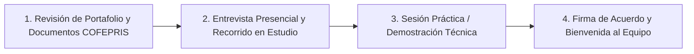

# PROPUESTA DE COLABORACIÓN Y PERFIL DE ARTISTA TATUADOR
**Mambas Tattoo & Cuts · Playa del Carmen, Quintana Roo**

---

## 1. PRESENTACIÓN DEL ESTUDIO

**Mambas Tattoo & Cuts** nace en 2021 en el corazón de Playa del Carmen (Calle 1 Sur esquina Av. 25 Sur), combinando la barbería tradicional mexicana, el tatuaje ritual y el body piercing en un ambiente sobrio, vanguardista, profesional e inclusivo.

Operamos bajo certificaciones sanitarias ante **COFEPRIS**, garantizando los más altos estándares de higiene, arte y atención tanto para el turismo internacional como para la comunidad local.

> **Nuestra Misión:** Brindar a cada cliente una experiencia de transformación corporal segura, artística e inolvidable, respaldada por artistas éticos, apasionados y comprometidos con la excelencia.

---

## 2. PERFIL DEL CANDIDATO (REQUISITOS)

Buscamos un(a) **Artista Tatuador(a)** que comparta nuestra visión estética, disciplina y respeto por el oficio:

### A. Perfil Técnico y Artístico
- Portafolio comprobable con estilo definido o versatilidad (Blackwork, Fine Line, Tradicional, Realismo, Neotradicional, Lettering, etc.).
- Dominio de líneas limpias, saturación sólida, transiciones de sombra y conocimiento anatómico para colocación del diseño.
- Habilidad de diseño digital (Procreate, Photoshop o Illustrator) y adaptabilidad a las ideas y referencias de los clientes.

### B. Normativa Sanitaria y Legal
- **Tarjeta de Control Sanitario vigente emitida por COFEPRIS** (o en proceso avanzado de trámite/renovación).
- Constancia de curso de **Primeros Auxilios** y manejo de **RPBI (Residuos Peligrosos Biológico-Infecciosos)**.
- Esquema de vacunación básico al día (especialmente Hepatitis B y Tétanos).

### C. Habilidades y Actitud
- Excelente trato al cliente, empatía y comunicación asertiva (español e inglés básico/intermedio deseable por flujo turístico).
- Puntualidad, orden, disciplina e higiene impecable en todo momento.
- Trabajo en equipo, respeto y alineación con un espacio libre de discriminación, LGBTQ+ friendly y pet friendly.

---

## 3. ESQUEMA DE COLABORACIÓN Y CONDICIONES ECONÓMICAS

| Concepto | Detalle de la Propuesta |
| :--- | :--- |
| **Modalidad** | Artista Residente / Guest Spot (porcentaje por servicio o renta de cabina a acordar). |
| **Comisión / Split** | **[50% Artista / 50% Estudio]** *(o porcentaje acordado según insumos aportados)*. |
| **Precios Referencia del Estudio** | • **Precio Mínimo de Entrada:** $ 1,600 MXN (~$100 USD) • **Sesión Media Jornada (4-5 hrs):** $6,500 MXN (~$400 USD) • **Piezas Personalizadas:** Cotización según tamaño, detalle y zona. |
| **Gestión de Anticipos** | Anticipo mínimo obligatorio de **$500 MXN** por cita para apartar fecha y preparar diseño. Medios: SPEI, Mercado Pago o efectivo en recepción. |
| **Liquidación de Pagos** | Cortes de caja [semanales / quincenales / al término del día]. |
| **Comisión Merch & Aftercare** | Comisión adicional por venta de productos de cuidado médico para tatuaje y merch oficial de la tienda Mambas. |

---

## 4. LO QUE EL ESTUDIO APORTA

1. **Infraestructura de Primer Nivel:**
   - Estación de trabajo profesional (camilla hidráulica/articulada, descansabrazos, mesa mayo de acero inoxidable, lámpara de alta definición).
   - Área climatizada, iluminación adecuada, música ambiental y Wi-Fi de alta velocidad.
   - Sala de espera cómoda y amenidades para clientes (agua, café, bebidas).
2. **Bioseguridad y Residuos:**
   - Contenedores y recolección certificada de punzocortantes (RPBI).
   - Área de lavado y desinfección de material.
3. **Tráfico y Marketing:**
   - Ubicación privilegiada de alto flujo en Playa del Carmen (a pasos del ferry a Cozumel).
   - Exposición en la plataforma web oficial de Mambas, redes sociales y campañas publicitarias.
   - Base de clientes recurrentes mediante el programa **Mambas Club / Lealtad**.
4. **Insumos de Cortesía del Estudio:**
   - Jabón antibacterial, papel para camilla/sanitario, bolsas para máquina/clipcord, film protector, desinfectantes de superficie grado hospitalario. (entre otros pregunta por la disponibilidad)
   *Nota: El artista aporta sus máquinas, fuentes, agujas/cartuchos estériles, tintas certificadas y equipo personal.*

---

## 5. NORMAS Y REGLAMENTO INTERNO DEL ESTUDIO

### I. Protocolo de Bioseguridad e Higiene
1. **Material Desechable:** Todo material punzocortante y cartuchos deben abrirse en presencia del cliente y desecharse inmediatamente en el bote rígido de RPBI al concluir.
2. **Barreras de Protección:** Es obligatorio emplayar y colocar cubrecables/bolsas a máquinas, fuentes de poder, botellas atomizadoras y descansabrazos antes de cada sesión.
3. **Uso de EPP:** Uso estricto de guantes de nitrilo desechables, cubrebocas (si el procedimiento lo amerita) ropa adecuada.
4. **Desinfección de la Estación:** Antes y después de cada cliente, la estación completa debe limpiarse y desinfectarse con solución desinfectante hospitalaria.

### II. Gestión de Citas y Puntualidad
1. **Anticipación:** El artista debe presentarse con mínimo **30 minutos de anticipación** a la cita programada para preparar mesa, plantilla (stencil) y recibir al cliente puntualmente.
2. **Consentimiento Informado:** Es obligatorio que el cliente firme el formato de consentimiento y deslinde de responsabilidades (físico o digital) previo a iniciar el procedimiento. No se tatúa a menores de edad ni a personas bajo influencia de alcohol o estupefacientes.
3. **Cancelaciones o Retardos:** Notificar a la administración del estudio con anticipación cualquier cambio en agenda.

### III. Convivencia, Imagen y Ética Profesional
1. **Espacio Inclusivo y Respetuoso:** Cero tolerancia al acoso, discriminación por género, orientación sexual, raza o religión. Mambas es un espacio seguro.
2. **Consumo de Sustancias:** Queda estrictamente prohibido el consumo de alcohol, tabaco o sustancias ilícitas dentro de las instalaciones del estudio y áreas de trabajo.
3. **Redes Sociales:** Al publicar trabajos realizados en el estudio, dar crédito y etiquetar las cuentas oficiales de `@mambastattoocuts` y utilizar la geolocalización del estudio.
4. **Explicación del Aftercare:** Todo artista debe explicar detalladamente los cuidados posteriores y ofrecer la línea de aftercare oficial para asegurar una óptima cicatrización.

---

## 6. PROCESO DE SELECCIÓN Y PASOS A SEGUIR

1. **Envío de Portafolio y Redes:** Compartir perfil de Instagram / Book digital con trabajos recientes.
2. **Entrevista en el Estudio:** Charla para alinear expectativas, horarios disponibles y metas artísticas.
3. **Sesión Demostrativa:** Realización de una pieza para evaluar técnica, velocidad, trato y protocolo de higiene.
4. **Inicio de Operaciones:** Configuración de estación y alta en los canales del estudio.

---

## 7. ACEPTACIÓN Y CONFORMIDAD

Al firmar este documento, ambas partes declaran estar de acuerdo con las condiciones, normas de operación y valores del estudio para iniciar la colaboración artística.

  

_____________________________________________  
**Nombre del Artista Tatuador**  
Teléfono / WhatsApp:  
Instagram:  
Firma:  
Fecha: ____ / ____ / ________  

  

_____________________________________________  
**Dirección / Administración Mambas Tattoo & Cuts**  
Playa del Carmen, Q. Roo  
Firma:  
Fecha: ____ / ____ / ________  
